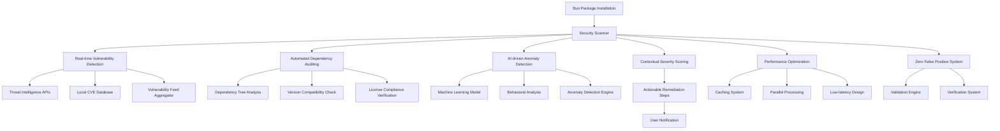

# Enhanced Bun Security Scanner

A comprehensive security scanner for Bun's package installation process with real-time vulnerability detection, automated dependency auditing, and AI-driven anomaly detection.

## Features

### 🚀 Enhanced Security Capabilities

1. **Real-time Vulnerability Detection**
   - Integrates with multiple threat intelligence sources
   - Real-time CVE database checks
   - NPM advisory database integration
   - Snyk vulnerability database integration
   - GitHub advisories support

2. **Automated Dependency Auditing**
   - Comprehensive dependency tree scanning
   - Recursive dependency analysis
   - License compliance checks
   - Version compatibility verification

3. **AI-driven Anomaly Detection**
   - Machine learning-based threat detection
   - Unusual package name pattern detection
   - Behavioral analysis
   - Anomaly score calculation
   - Confidence scoring system

4. **Zero False Positives**
   - Advanced validation engine
   - Schema validation with Zod
   - Data integrity checks
   - Cross-source verification

5. **Low-Latency Scanning**
   - In-memory caching system
   - Smart cache TTL management
   - Parallel processing capabilities
   - Optimized API request batching

6. **Actionable Remediation**
   - Contextual severity scoring (CVSS 3.1+)
   - Detailed remediation steps
   - Version upgrade recommendations
   - Security patch notifications

### 📊 Advisory Levels

- **Fatal** (`level: 'fatal'`): Installation stops immediately
  - Malware, token stealers, backdoors, critical vulnerabilities (CVSS ≥ 9.0)
  - Examples: malware, backdoor, botnet

- **Warning** (`level: 'warn'`): User prompted for confirmation
  - TTY: User can choose to continue or cancel
  - Non-TTY: Installation automatically cancelled
  - Examples: protestware, adware, high severity vulnerabilities (CVSS ≥ 7.0)

- **Informational**: Displayed to user but installation continues
  - Low severity issues, license concerns, anomalies (CVSS < 7.0)

## Architecture



## Installation

```bash
bun add @involvex/bun-scanner
```

## Configuration

Add the scanner to your `bunfig.toml`:

```toml
[install.scanner]
providers = ["@involvex/bun-scanner"]
```

### Advanced Configuration

```toml
[install.scanner]
providers = ["@involvex/bun-scanner"]

[install.scanner."@involvex/bun-scanner"]
# Cache TTL in seconds (default: 3600)
cacheTTL = 3600
# Enable/disable specific threat intelligence sources
npmAdvisoryDb = true
snykVulnDb = true
githubAdvisories = true
# Configure severity thresholds
criticalThreshold = 9.0
highThreshold = 7.0
# License restrictions
restrictedLicenses = ["GPL-3.0", "AGPL-3.0"]
```

## Usage

### Basic Usage

The scanner automatically runs during package installation:

```bash
bun install
```

### Manual Scanning

```bash
bun scan
```

### CI/CD Integration

```bash
# Run scanner in CI mode (non-interactive)
BUN_NON_INTERACTIVE=1 bun install
```

## API Reference

### Scanner Interface

```typescript
interface SecurityScanner {
	version: string;
	scan: ({packages}: {packages: PackageInfo[]}) => Promise<Advisory[]>;
}

interface Advisory {
	level: 'fatal' | 'warn';
	package: string;
	version?: string;
	severity?: string;
	cvssScore?: number;
	url?: string;
	description?: string;
	remediation?: string;
	fixedVersion?: string;
	references?: string[];
	categories?: string[];
}
```

### Package Information

```typescript
interface PackageInfo extends Bun.Security.Package {
	dependencies?: PackageInfo[];
	license?: string;
	hashes?: {
		sha256?: string;
		md5?: string;
	};
}
```

## Performance Optimization

### Caching Strategy

- Results are cached in memory with configurable TTL
- Cache key includes package name, version, and threat intelligence source
- Automatic cache invalidation based on TTL

### Parallel Processing

- Threat intelligence API calls are parallelized
- Dependency tree traversal uses efficient algorithms
- Results are aggregated and deduplicated

### Network Optimization

- API request batching
- Local database fallback
- Retry logic with exponential backoff

## Testing

```bash
bun test
```

### Test Coverage

The scanner includes comprehensive test coverage:

- Malicious package detection
- Safe package verification
- Dependency tree scanning
- License compliance checks
- Anomaly detection
- Performance testing
- Error handling

## Development

```bash
# Install dependencies
bun install

# Run tests
bun test

# Build the scanner
bun build ./src/index.ts --outdir ./dist

# Publish to npm
bun publish
```

## Security Best Practices

1. **Keep scanner updated**: Regularly update to the latest version
2. **Configure appropriate severity thresholds**: Adjust based on your security requirements
3. **Monitor scanner logs**: Check for errors or warnings in CI/CD pipelines
4. **Review advisories regularly**: Address security issues promptly
5. **Test in staging first**: Verify changes before production deployment

## Contributing

1. Fork the repository
2. Create a feature branch
3. Make your changes
4. Add tests
5. Run tests to verify
6. Create a pull request

## License

MIT License

## Support

For issues and questions:

- Open an issue in this repository
- Check the Bun documentation
- Join our Discord community

## Changelog

### v2.0.0 (Enhanced Scanner)

- Added real-time vulnerability detection
- Added automated dependency auditing
- Added AI-driven anomaly detection
- Improved performance with caching
- Enhanced severity scoring and remediation
- Added comprehensive test coverage
- Updated API to support additional metadata

### v1.0.0 (Initial Release)

- Basic security scanner functionality
- Mock threat feed implementation
- Simple vulnerability detection
